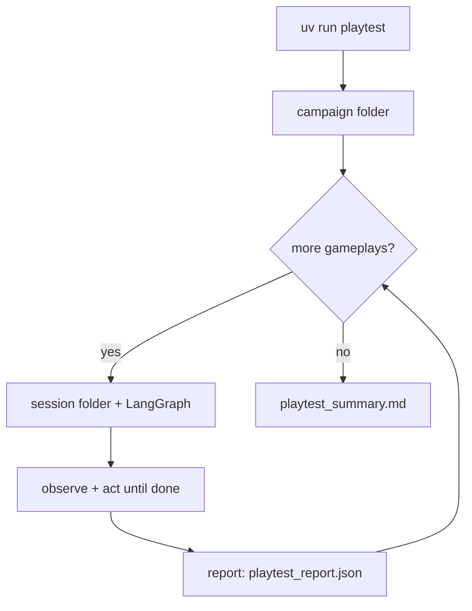

# AI Game Playtesting Agent

[](https://github.com/ysskrishna/ai-game-playing-agent/blob/main/LICENSE) [](https://www.python.org/) [](https://langchain-ai.github.io/langgraph/) [](https://platform.openai.com/docs/models/gpt-4o) [](https://ysskrishna.space)

Autonomous AI agent playtests [2048](https://play2048.co/) in Chromium via Playwright: **GPT-4o vision** reads the board from screenshots, LangGraph orchestrates sessions, and each campaign gets a structured playtesting report with metrics and turn logs. 

<p align="center">
  
</p>

## Setup

**Prerequisites**

- Python 3.12+ (see [pyproject.toml](pyproject.toml))
- [uv](https://docs.astral.sh/uv/) for install and run

**Install**

```bash
uv sync
uv run playwright install chromium
cp .env.example .env
```

Edit `.env` and set `OPENAI_API_KEY`. The CLI exits with an error if the key is missing.

## Architecture

The agent is a Python package run with **uv**. **LangGraph** orchestrates each gameplay; **Playwright** controls the browser; **GPT-4o** reads screenshots (vision-only, no DOM parsing) and writes qualitative report sections.

| Piece | Technology | Role |
| --- | --- | --- |
| Runtime & CLI | [uv](https://docs.astral.sh/uv/) + Python 3.12 | Install deps, run `playtest`, load `.env` |
| Orchestration | [LangGraph](https://langchain-ai.github.io/langgraph/) | Per-session state machine: observe → act → … → report |
| Browser | [Playwright](https://playwright.dev/python/) | Open 2048 in Chromium, arrow keys, JPEG screenshots |
| Perception & decisions | GPT-4o via `langchain-openai` | Structured JSON from each screenshot (grid, score, move) |
| Report synthesis | GPT-4o (text) | Campaign summary sections from session metrics |
| Schemas & config | Pydantic + `pydantic-settings` | `BoardObservation`, events, settings from `.env` |

**Game:** [play2048.co](https://play2048.co/) in the browser. **State:** screenshot → vision model (not DOM/canvas hooks). **Artifacts:** timestamped folders under `artifacts/campaign_<id>/` (see [Project layout](#project-layout)).



Within each session, LangGraph repeats **observe** (screenshot + vision) and **act** (press move) until game over or `--max-moves`, then runs **report**. The CLI runs that graph once per `--runs`, then aggregates metrics into one campaign markdown file.

## Reproduce a run

**Quick local run**

```bash
uv run playtest --runs 1 --max-moves 25 --headed
```

**Match the included example campaign** (3 gameplays, 20 moves each, visible browser — same flags used for [examples/campaign_20260524201909](examples/campaign_20260524201909/)):

```bash
uv run playtest --runs 3 --max-moves 20 --headed
```

Each CLI invocation starts a **new** campaign folder under `artifacts/`. Folder names use timestamps, so they will differ from `examples/campaign_20260524201909`.

**Output from a live run**

```text
artifacts/campaign_20260524201909/
  playtest_summary.md
  20260524201909/
    playtest_report.json
    turn_log.jsonl
    screenshots/move_0000.jpg
    screenshots/move_0001.jpg
    ...
  20260524202005/
    ...
```

Failure Analysis, Behavioral Observations, and Suggested Improvements are generated by GPT from the session metrics. Scores and wording will vary between runs.

## Sample playtesting report

A committed sample campaign is in the repo:

**[examples/campaign_20260524201909/playtest_summary.md](examples/campaign_20260524201909/playtest_summary.md)**

That report includes:

- **Test configuration** — game URL, model, runs, max moves, start/end times
- **Campaign metrics** — win rate, scores, best tiles, invalid moves, stalls, actions per minute
- **Per-run results** — one row per session with paths to `turn_log.jsonl`
- **Failure analysis**, **behavioral observations**, and **suggested improvements** (LLM-written from the metrics)

## Project layout

```text
src/ai_game_playtesting_agent/
  main.py       # CLI: campaign loop, starts sessions, writes summary
  graph.py      # LangGraph: observe → act → … → report
  browser.py    # Playwright: open game, arrow keys, screenshots
  vision.py     # GPT-4o: screenshot → grid, score, chosen move
  events.py     # Detect invalid moves, stalls, score/tile changes
  report.py     # Session JSON + campaign markdown (metrics + LLM sections)
  sessions.py   # artifacts/campaign_<id>/<session_id>/ folders
  config.py     # Settings from .env
  models.py     # Pydantic schemas
```

## Cost

Each move uses one GPT-4o vision call. A 50-move game uses about 50 vision requests plus one text call for the campaign summary. Use `--max-moves` and `--runs` sparingly while developing.

## Limitations

- Vision-only: no DOM parsing; occasional misreads are logged as vision errors or events.
- Depends on play2048.co layout and availability.
- Not tuned to play optimally — focused on playtesting and observation.

## Support

If you find this project helpful:

- ⭐ Star the repository
- 🐛 Report issues
- 🔀 Submit pull requests
- 💝 [Sponsor on GitHub](https://github.com/sponsors/ysskrishna)

## License

MIT © [Y. Siva Sai Krishna](https://github.com/ysskrishna) — see [LICENSE](https://github.com/ysskrishna/ai-game-playing-agent/blob/main/LICENSE) for details.

---

<p align="left">
  <a href="https://github.com/ysskrishna">Author's GitHub</a> •
  <a href="https://linkedin.com/in/ysskrishna">Author's LinkedIn</a> •
  <a href="https://ysskrishna.space">Author's site</a> •
  <a href="https://github.com/ysskrishna/ai-game-playing-agent/issues">Report Issues</a>
</p>
