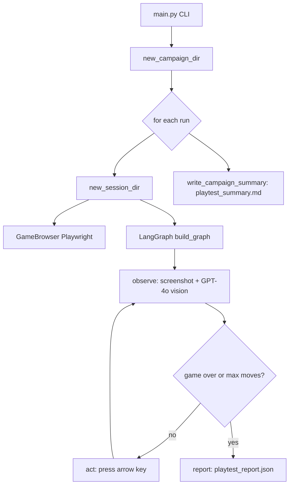

# AI Game Playtesting Agent

Autonomous agent that plays [2048](https://play2048.co/) in Chromium via Playwright, reads the board with **GPT-4o vision**, and writes a structured playtesting report for each campaign.

## Setup

**Prerequisites**

- Python 3.12+ (see [pyproject.toml](pyproject.toml))
- [uv](https://docs.astral.sh/uv/) for install and run

**Install**

```bash
uv sync
uv run playwright install chromium
cp .env.example .env
```

Edit `.env` and set `OPENAI_API_KEY`. The CLI exits with an error if the key is missing.

## Architecture

Each `uv run playtest` call creates one **campaign** folder. Inside the campaign, each gameplay is a **session** with its own logs and screenshots. A LangGraph loop drives each session: screenshot, vision, arrow key, repeat until game over or `--max-moves`, then write session JSON. After all sessions finish, the agent writes one campaign summary markdown file.



A session stops when the vision model reports **game over** or when **actions taken** reach `--max-moves`.

Optional design notes: [initial_plan.md](initial_plan.md).

## Reproduce a run

**Quick local run**

```bash
uv run playtest --runs 1 --max-moves 25 --headed
```

**Match the included example campaign** (3 gameplays, 20 moves each, visible browser — same flags used for [examples/campaign_20260524201909](examples/campaign_20260524201909/)):

```bash
uv run playtest --runs 3 --max-moves 20 --headed
```

Each CLI invocation starts a **new** campaign folder under `artifacts/`. Folder names use timestamps, so they will differ from `examples/campaign_20260524201909`.

**Output from a live run**

```text
artifacts/campaign_20260524201909/
  playtest_summary.md
  20260524201909/
    playtest_report.json
    turn_log.jsonl
    screenshots/move_0000.jpg
    screenshots/move_0001.jpg
    ...
  20260524202005/
    ...
```

Failure Analysis, Behavioral Observations, and Suggested Improvements are generated by GPT from the session metrics. Scores and wording will vary between runs.

## Sample playtesting report

A committed sample campaign is in the repo:

**[examples/campaign_20260524201909/playtest_summary.md](examples/campaign_20260524201909/playtest_summary.md)**

That report includes:

- **Test configuration** — game URL, model, runs, max moves, start/end times
- **Campaign metrics** — win rate, scores, best tiles, invalid moves, stalls, actions per minute
- **Per-run results** — one row per session with paths to `turn_log.jsonl`
- **Failure analysis**, **behavioral observations**, and **suggested improvements** (LLM-written from the metrics)

## Project layout

```text
src/ai_game_playtesting_agent/
  main.py       # CLI: campaign loop, starts sessions, writes summary
  graph.py      # LangGraph: observe → act → … → report
  browser.py    # Playwright: open game, arrow keys, screenshots
  vision.py     # GPT-4o: screenshot → grid, score, chosen move
  events.py     # Detect invalid moves, stalls, score/tile changes
  report.py     # Session JSON + campaign markdown (metrics + LLM sections)
  sessions.py   # artifacts/campaign_<id>/<session_id>/ folders
  config.py     # Settings from .env
  models.py     # Pydantic schemas
```

## Cost

Each move uses one GPT-4o vision call. A 50-move game uses about 50 vision requests plus one text call for the campaign summary. Use `--max-moves` and `--runs` sparingly while developing.

## Limitations

- Vision-only: no DOM parsing; occasional misreads are logged as vision errors or events.
- Depends on play2048.co layout and availability.
- Not tuned to play optimally — focused on playtesting and observation.
