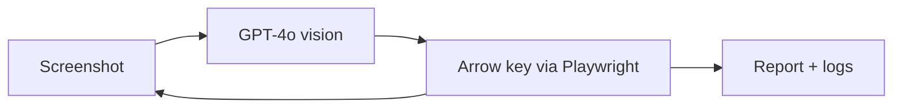
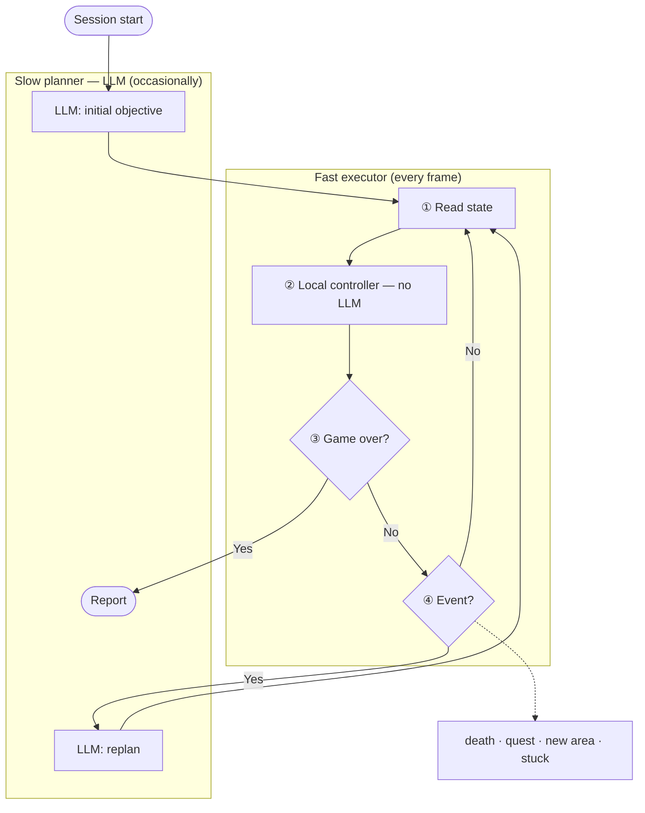
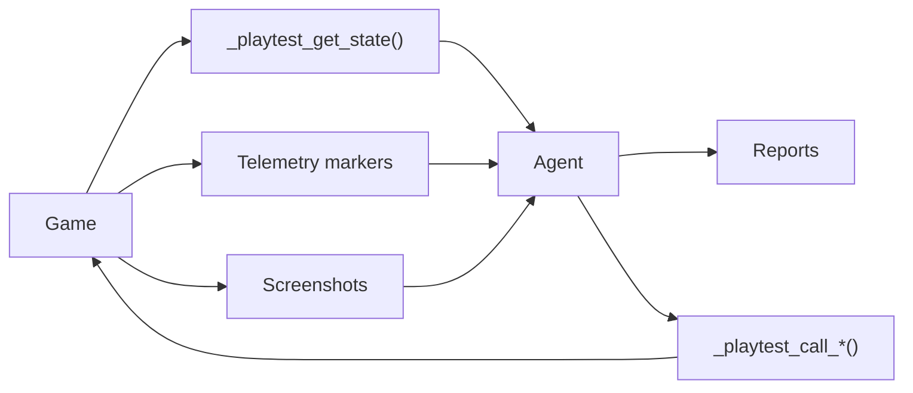

# AI Game Playtesting Agent — Evolution Notes

## Today (2048 agent)



One vision LLM call per move. Works because 2048 waits for input. Real-time games run at 10–60+ ticks/sec; an LLM call takes hundreds of ms to seconds.

---

## 1. How will the solution evolve for more real-time games (not multiplayer)?

### Latency breakdown

| Step | Today | Bottleneck |
|------|-------|------------|
| Observe | Screenshot | ~50–100 ms |
| Structure + reason | Vision LLM → grid + move | **~1–3 s** |
| Act | Arrow key | ~10 ms |

At 30 ticks/sec (~33 ms/frame) the LLM cannot run inside this loop every tick.

### Core idea

Don't make GPT-4o faster. **Stop using the LLM to press buttons every frame.**

Screen-only agents can take seconds (or longer) per decision — some setups pause the game while the model thinks. Fine for slow games; not for reflex gameplay.

### Split into two systems



| | Slow planner | Fast executor |
|---|-------------|---------------|
| **When** | On events | Every tick |
| **Does** | Plan, recover, write reports | Move, dodge, navigate |
| **How** | GPT-4o | Rules, cached actions, behavior trees |

---

## 2. What does the solution look like when you have full access to source code and ability to add markers in it?

Today the agent sits outside the game: screenshot, vision call, arrow key. If you control the source, you wire the running game to expose state and fire events when something meaningful happens. Same LangGraph session as §1 — only the bridge changes.

### Three input channels



| Channel | What it provides | Replaces |
|---------|-----------------|---------|
| `_playtest_get_state()` | Exact HP, position, quest step, inventory | Vision model guessing from pixels |
| Telemetry markers | Events when meaningful things happen | Screen-diffing for progression |
| Screenshots | Visual validation only | Nothing — kept as secondary check |

The Python side talks to the game over a simple bridge (TCP or JSON-RPC; [godot-ai-playtest](https://github.com/marcushale/godot-ai-playtest) does this in Godot).

### Exact state

Instead of a vision model estimating things from pixels, the game returns its own internal state directly. The schema is defined by the game — the agent reads whatever the game actually tracks. Field names, structure, and granularity are entirely up to the game developer.

```json
{
  "hp": 75,               // exact value — not estimated from a pixel bar
  "position": [145, 78],  // world coordinates
  "ammo": 12,             // shooter; or "quest", "inventory_size" for an RPG, etc.
  "enemies_in_range": 3   // whatever the game exposes and the agent needs
}
```

No inference, no misreads — the agent reads whatever the game knows about itself.

### Markers for progression

The game emits named events when something meaningful happens. What counts as meaningful is game-specific — these are examples of the kind of markers you might add, not a fixed set:

- `QuestCompleted` — progression milestone (RPG)
- `WaveCleared` — round boundary (shooter)
- `PlayerDied`, `CheckpointReached` — universal across most games

The agent knows progression happened without diffing screens. Reports can list which areas, waves, or quests were actually exercised — not just total play time.

### Actions via hooks

Instead of spamming arrow keys, the agent calls typed hooks to act or inject state directly. Each game exposes the hooks that make sense for it — these are examples of the kind of thing you might add, not a required interface:

- `_playtest_call_go_to("boss_arena")` — teleport to a named location
- `_playtest_call_spawn_enemy("heavy")` — inject an enemy for testing
- `_playtest_call_set_ammo(0)` — force an edge-case state instantly

This makes it possible to reproduce edge cases — a shooter at zero ammo, a platformer at the final level with one life — without hours of manual play. On web games, expose element IDs so the agent clicks by name instead of hunting pixels in a menu.

### What screenshots are still for

Internal state tells the agent a health bar should be visible — only visual inspection confirms it rendered correctly. Screenshots stay as a secondary channel for:

- Broken UI or misaligned elements
- Wrong animations or missing assets
- Anything the game's own state cannot describe

**State tells the agent what exists. Markers tell it what happened. Screenshots verify what the player actually sees.**
