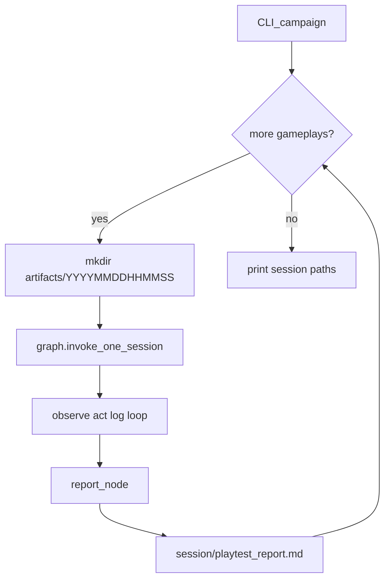

# AI Game Playtesting Agent Plan

## Goals (mapped to assignment)

| Requirement | Approach |
|-------------|----------|
| Launch & control game | Playwright (called from LangGraph **act** node) → `play2048.co`, arrows, restart |
| Observe state | Screenshot → **GPT-4o** structured JSON (vision-only; your choice) |
| Decide actions | Same vision call returns `move` + `reasoning` |
| Detect events | **observe** node diffs consecutive states → append to `PlaytestState.events` |
| Multi-run + report | CLI runs N **gameplays**; each gameplay = one **session** folder + per-session **report** node |
| Artifact storage | `artifacts/<YYYYMMDDHHMMSS>/` — screenshots, logs, and report colocated per session |

You chose **remote 2048** (`play2048.co`) and **vision-only** state.

**Terminology:**

- **Gameplay** — one full 2048 game (start → game over or `--max-moves`).
- **Session** — one gameplay’s isolated artifact root: `artifacts/20250524143022/`.
- **Campaign** (optional) — a single CLI invocation that runs `--runs N` gameplays, producing N session folders (not one shared folder).

---

## Why use a framework (and which one)

You do **not** need to hand-roll the agent loop, state transitions, or “what happens after game over.” An orchestration framework handles that; you still own **game-specific** pieces (2048 prompt, metrics, Playwright key map).

### Recommended: **LangGraph**

| Fit | Reason |
|-----|--------|
| Assignment loop | Natural **state machine**: `observe → act → log → route` with conditional edges (`game_over`, `max_moves`, `runs_done`) |
| Multiple gameplays | CLI outer loop: new `session_dir` per gameplay; graph invoked once per session |
| Debugging / Loom | Graph can be visualized (`graph.get_graph().draw_mermaid()`); checkpoints optional for replay |
| GPT-4o vision | `langchain-openai` `ChatOpenAI(model="gpt-4o")` with image in message content |
| Playwright | Keep a **thin** `BrowserToolkit`-style wrapper (custom tools, not generic click-by-selector agents) |

**What LangGraph replaces:** custom `agent.py` / `runner.py` control flow.  
**What you still write (~40% of code):** Pydantic state schema, vision prompt + JSON schema, Playwright helpers, event diff rules, report templates.

### Considered but not primary

| Framework | Verdict |
|-----------|---------|
| **CrewAI** | Good for **role-based teams** (Researcher + Writer). Overkill for a 50ms-tight game loop; useful only if you want a separate “Playtest Analyst” crew for the report. Adds process overhead and less explicit control flow than a graph. |
| **browser-use** | Strong for open-ended “do task on the web” agents. Less ideal when you need **fixed metrics**, JSONL logs, and assignment-shaped reports; harder to explain in architecture doc. |
| **LangChain AgentExecutor + Playwright toolkit** | Generic ReAct over DOM tools (`click_element`, `extract_text`). Conflicts with **vision-only** and is fragile on canvas-like UIs. Use Playwright **directly** inside graph nodes instead. |
| **AutoGen / Swarm** | Conversation-centric multi-agent; weaker fit than LangGraph for cyclic env interaction. |

**Plan decision:** **LangGraph end-to-end** for play loop + report. Optional later: CrewAI **only** for report synthesis if you want a second framework in the README—for v1, a single **report** LangGraph node with one GPT-4o call is enough.

---

## High-level architecture (LangGraph)



**`PlaytestState` (TypedDict or Pydantic) — scoped to a single gameplay/session:**

- `session_id: str` — folder name, e.g. `20250524143022` (`datetime.now().strftime("%Y%m%d%H%M%S")`)
- `session_dir: Path` — `artifacts/20250524143022/`
- `move_index`, `max_moves`
- `current_board`, `previous_board`, `last_screenshot_path`
- `events: list[GameEvent]`
- `session_start_time` (ISO8601 in `session_meta.json`)
- `final_report_path: str | None`

Each **node** is a plain Python function `(state) -> partial state update`; LangGraph merges updates.

---

## Repository layout

```
jabali/                                    # local repo folder (name may differ on GitHub)
  pyproject.toml                           # name = "ai-game-playtesting-agent"
  plan.md
  .env.example
  README.md
  src/ai_game_playtesting_agent/
    config.py
    models.py              # BoardState, GameEvent, RunSummary
    browser.py             # Playwright sync wrapper (used by tools/nodes)
    vision.py              # build multimodal message + parse structured output
    tools.py               # optional @tool wrappers if you want LangChain tools API
    events.py              # diff boards → events
    sessions.py            # new_session_dir(), path helpers
    graph/
      __init__.py
      state.py             # PlaytestState
      nodes.py             # observe, act, log_events, run_end, report
      edges.py             # routing functions
      build.py             # StateGraph compile
    main.py                # CLI entry (playtest script → main:main)
  reports/sample_playtest_report.md
  artifacts/               # gitignored; only timestamped children
```

---

## Session folders and artifacts (required)

Every **gameplay** gets a new session directory at start time. ID format: **`YYYYMMDDHHMMSS`** (local time, 24h), e.g. `20250524143022`.

```
artifacts/
  20250524143022/
    session_meta.json       # session_id, started_at, game_url, model, max_moves, headed
    screenshots/
      move_0000.png
      move_0001.png
      game_over.png         # optional milestone captures
    logs/
      moves.jsonl           # one line per turn: board, move, reasoning, score
      events.jsonl          # derived events (stall, game_over, etc.)
    playtest_report.md      # assignment report for THIS gameplay
    playtest_report.json    # same content, machine-readable
  20250524144501/           # next gameplay (--runs 2)
    ...
```

**Rules:**

- Create `session_dir` **before** the first screenshot (in CLI or `session_start` node).
- **All** screenshots, JSONL logs, and the playtest report for that gameplay live **only** under that folder — no shared flat `screenshots/` or `logs/` at repo root.
- If two gameplays start in the same second (unlikely), append `_2`, `_3` to the folder name to avoid collisions.
- `observe_node` writes: `session_dir/screenshots/move_{move_index:04d}.png`
- `log_events_node` appends to `session_dir/logs/*.jsonl` (flush each line for crash safety).
- `report_node` writes reports into `session_dir/` (not `reports/` — that dir holds only a **committed sample** for submission).

**CLI `--runs N`:** loop N times → N timestamped session folders → N independent reports. Optionally print a one-line campaign summary listing session paths (no required aggregate report unless you want a bonus `artifacts/campaign_summary.json` linking session IDs).

**Helper (`sessions.py`):**

```python
def new_session_dir(artifacts_root: Path = Path("artifacts")) -> tuple[str, Path]:
    session_id = datetime.now().strftime("%Y%m%d%H%M%S")
    session_dir = artifacts_root / session_id
    # collision guard → session_id + "_2" if exists
    (session_dir / "screenshots").mkdir(parents=True)
    (session_dir / "logs").mkdir(parents=True)
    return session_id, session_dir
```

Update [`.gitignore`](.gitignore): `artifacts/` (entire tree gitignored except documented sample under `reports/`).

---

## Tech stack (`uv`)

**Project name:** `ai-game-playtesting-agent`  
**Import package:** `ai_game_playtesting_agent`

**Dependencies:**

- `langgraph` — orchestration
- `langchain-openai` — `ChatOpenAI` + GPT-4o vision
- `langchain-core` — messages, structured output / `with_structured_output`
- `playwright` — browser
- `pydantic`, `pydantic-settings`, `python-dotenv`
- `pillow` (optional) — crop board region

**Not needed for v1:** `crewai`, `langchain-community` Playwright toolkit (DOM tools), reinforcement learning libs.

```bash
OPENAI_API_KEY=...
PLAYTEST_GAME_URL=https://play2048.co/
OPENAI_MODEL=gpt-4o
```

**CLI entry** (`pyproject.toml`):

```toml
[project.scripts]
playtest = "ai_game_playtesting_agent.main:main"
```

---

## LangGraph nodes (implementation detail)

### `session_start` (first node or CLI pre-step)

1. If `session_dir` not set: call `new_session_dir()` → set `session_id`, `session_dir`
2. Write `session_meta.json`; launch browser; navigate to game URL

### `observe_node`

1. `browser.screenshot()` → `session_dir/screenshots/move_{move_index:04d}.png`
2. Call GPT-4o → `BoardState` (+ `move`, `reasoning`)
3. Append turn record to `session_dir/logs/moves.jsonl`
4. If `previous_board` exists, `events.diff(...)` → append `events.jsonl` + `state.events`
5. Increment `move_index`

### `act_node`

1. If `current_board.move == "restart"` → click Try again; else `browser.press_arrow(move)`
2. `time.sleep(ANIMATION_MS)` (config)
3. Return `{}` or bump counters only

### Routing (`edges.py`)

- `should_end_gameplay`: `game_over` OR `move_index >= max_moves` → `report_node`
- else → `act` → `log_events` → `observe`

### `report_node` (end of each session / gameplay)

1. **Deterministic metrics** from this session’s `events` + `moves.jsonl` (runs=1 per folder)
2. **Qualitative:** GPT-4o reads condensed log from `session_dir/logs/`
3. Write `session_dir/playtest_report.md` + `playtest_report.json`; embed relative screenshot paths
4. Close browser; return `final_report_path`

### CLI multi-gameplay loop (outside or wrapping graph)

```python
for i in range(config.runs):
    session_id, session_dir = new_session_dir()
    state = graph.invoke(initial_state(session_dir=session_dir, session_id=session_id))
    print(state["final_report_path"])
```

---

## Vision-only observation (unchanged semantics)

Structured JSON from GPT-4o per turn:

```json
{
  "grid": [[0,2,4,8], ...],
  "score": 1234,
  "best_tile": 128,
  "game_over": false,
  "won_2048": false,
  "move": "left",
  "confidence": "high",
  "reasoning": "merge left column 8s"
}
```

Use `ChatOpenAI.with_structured_output(BoardState)` or OpenAI JSON schema via LangChain.

**Validation in `observe_node`:** retry once on parse failure; log `vision_parse_error`; optional fallback move `up` to avoid graph hang.

**Stall detection in `log_events_node`:** identical grid+score after move, repeated same move → `stall_loop` / `agent_stuck` events.

---

## Browser control (`browser.py`)

Same as before: headless/headed Chromium, fixed viewport (1280×800), arrow keys, restart click, navigate to `PLAYTEST_GAME_URL`.

LangGraph does **not** replace Playwright—it **calls** it inside nodes. Avoid generic “agent picks CSS selector” unless you add it later.

---

## CLI

```bash
uv sync
uv run playwright install chromium
uv run playtest --runs 3 --max-moves 100 --headed
```

`main.py` loads config, builds graph via `build_graph()`, invokes with initial `PlaytestState`, prints artifact path.

Optional dev aid:

```python
# expose mermaid for README
print(app.get_graph().draw_mermaid())
```

---

## Playtesting report (assignment sections)

| Section | Source |
|---------|--------|
| Gameplay metrics | Python aggregation in `report_node` |
| Failure / Behavioral / Suggestions | GPT-4o in `report_node` |
| Logs & screenshots | Relative links inside `artifacts/<YYYYMMDDHHMMSS>/` |

Commit a **copy** of one real session report as [`reports/sample_playtest_report.md`](reports/sample_playtest_report.md) for submission (source of truth remains under `artifacts/`).

---

## README (submission + framework narrative)

Explain clearly:

1. **Why LangGraph** — cyclic env, conditional routing, inspectable graph (good for “architecture explanation” rubric)
2. **Why not CrewAI for the loop** — latency, less explicit state for game ticks
3. **What’s custom** — 2048 vision prompt, event diff, metrics, play2048.co control
4. Reproduce commands, cost estimate (~1 vision call/move), limitations (remote site, vision errors)

---

## Testing strategy

- Unit: `events.py` with fixture state pairs (no graph)
- Unit: `vision.py` parse from saved JSON fixtures
- Integration: compile graph + mock `observe_node` returning canned states (patch node or inject test graph)
- Manual: `uv run playtest --runs 1 --max-moves 20 --headed`

---

## Implementation order

1. `uv init` + LangGraph/OpenAI/Playwright deps + `models` + `config` (project name `ai-game-playtesting-agent`)
2. `browser.py` smoke test on play2048.co
3. `vision.py` + structured output tuning
4. `sessions.py` + artifact layout; wire paths in all nodes
5. `graph/` — single-session play loop + `report_node`
6. CLI multi-gameplay loop in `main.py` (`--runs`) + copy sample report to `reports/`
7. README with Mermaid graph diagram + Loom notes

---

## Risks and mitigations

| Risk | Mitigation |
|------|------------|
| Framework learning curve | Single small graph (~6 nodes); no subgraphs until needed |
| LangGraph + sync Playwright | Use sync Playwright in sync nodes, or one `async` graph with `async_playwright` consistently |
| Vision cost/latency | `--max-moves`, fewer `--runs` for dev |
| play2048.co changes | Fixed viewport; document test date; `--url` override |
| Generic browser agents wander | Fixed action set: 4 arrows + restart only |
